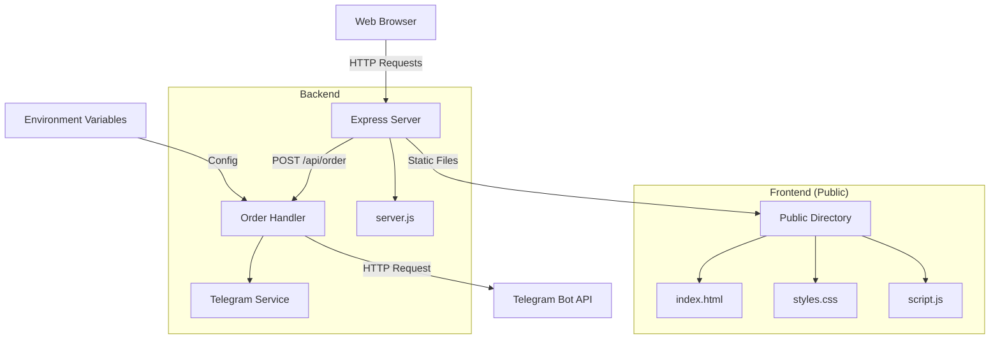

# Design Document

## Overview

The Product Order Telegram application is a simple web-based ordering system that captures user phone numbers, displays product options, and sends order details via Telegram notifications. The system follows a client-server architecture with a Node.js/Express backend serving static HTML/CSS/JS frontend files and handling Telegram API integration.

## Architecture



The application uses a simple request-response pattern where the frontend collects user input and sends order data to the backend, which then forwards the information to Telegram's Bot API.

## Components and Interfaces

### Frontend Components

**1. Phone Input Component**
- HTML input field with validation
- Real-time validation feedback
- Enables/disables product selection based on validity

**2. Product Display Component**
- Grid layout showing three products
- Each product card contains: name, price, description, and click handler
- Responsive design for mobile and desktop

**3. Order Summary Component**
- Dynamically generated summary display
- Shows selected product details and calculated total
- Confirmation/error message display area

**4. JavaScript Controller**
- Handles form validation
- Manages product selection events
- Sends AJAX requests to backend
- Updates UI based on responses

### Backend Components

**1. Express Server (server.js)**
- Serves static files from public directory
- Provides REST API endpoint for order processing
- Handles CORS and JSON parsing middleware

**2. Order Processing Handler**
- Validates incoming order data
- Formats message for Telegram
- Calls Telegram service
- Returns appropriate responses

**3. Telegram Service Module**
- Encapsulates Telegram Bot API communication
- Handles HTTP requests using axios
- Manages error handling and retries

## Data Models

### Order Data Structure
```javascript
{
  phoneNumber: string,     // User's phone number (validated)
  product: {
    name: string,          // Product name
    price: number,         // Product price in currency units
    description: string    // Product description
  },
  quantity: number,        // Always 1 for this implementation
  totalAmount: number      // Calculated total (price * quantity)
}
```

### Product Data Structure
```javascript
{
  id: string,              // Unique product identifier
  name: string,            // Display name
  price: number,           // Price in currency units
  description: string      // Product description
}
```

### Telegram Message Format
```javascript
{
  chat_id: string,         // From environment variable
  text: string,            // Formatted order message
  parse_mode: "HTML"       // For message formatting
}
```

## Error Handling

### Frontend Error Handling
- **Phone Validation Errors**: Display inline validation messages
- **Network Errors**: Show user-friendly error messages for connection issues
- **Server Errors**: Display generic error message with retry option
- **Timeout Handling**: 10-second timeout for order submission requests

### Backend Error Handling
- **Missing Environment Variables**: Log error and return 500 status
- **Invalid Request Data**: Validate input and return 400 with error details
- **Telegram API Errors**: Log error details and return 500 with generic message
- **Network Timeouts**: Implement retry logic with exponential backoff

### Error Response Format
```javascript
{
  success: false,
  error: {
    code: string,          // Error code for client handling
    message: string,       // User-friendly error message
    details?: string       // Additional error details (development only)
  }
}
```

## Testing Strategy

### Frontend Testing
- **Unit Tests**: Validate phone number validation logic
- **Integration Tests**: Test form submission and response handling
- **UI Tests**: Verify responsive design across different screen sizes
- **Manual Testing**: Cross-browser compatibility testing

### Backend Testing
- **Unit Tests**: Test order validation and Telegram message formatting
- **Integration Tests**: Test complete order flow with mock Telegram API
- **Error Handling Tests**: Verify proper error responses for various failure scenarios
- **Environment Tests**: Test behavior with missing/invalid environment variables

### End-to-End Testing
- **Happy Path**: Complete order flow from phone input to Telegram notification
- **Error Scenarios**: Test various error conditions and recovery
- **Performance**: Verify response times under normal load
- **Security**: Validate input sanitization and environment variable security

## Security Considerations

### Input Validation
- Sanitize phone number input to prevent injection attacks
- Validate all incoming request data on the server side
- Implement rate limiting to prevent abuse

### Environment Security
- Store sensitive credentials in environment variables only
- Never expose bot tokens or chat IDs in client-side code
- Use HTTPS in production for secure communication

### API Security
- Implement basic request validation
- Add request size limits to prevent large payload attacks
- Consider implementing basic authentication for production use

## Performance Considerations

### Frontend Optimization
- Minimize CSS and JavaScript files
- Use efficient DOM manipulation
- Implement debouncing for input validation

### Backend Optimization
- Use connection pooling for HTTP requests
- Implement caching for static product data
- Add request timeout handling

### Scalability Notes
- Current design supports single-server deployment
- For scaling: consider adding database for order logging
- Implement queue system for high-volume Telegram notifications